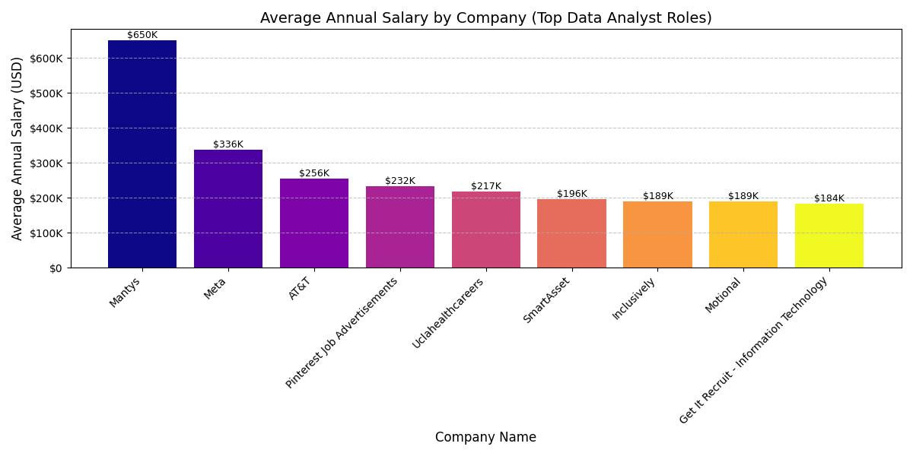
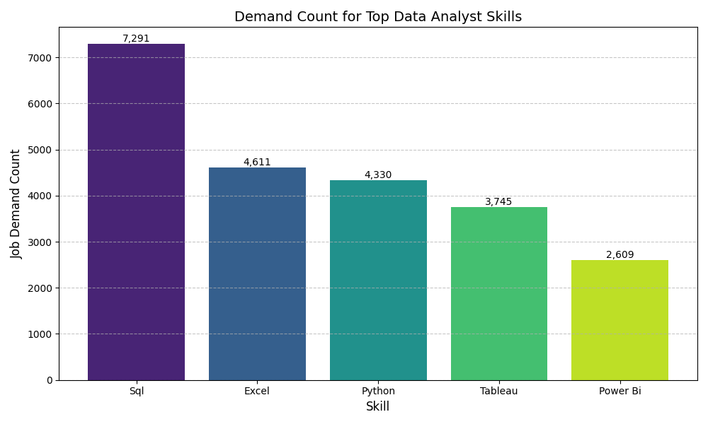
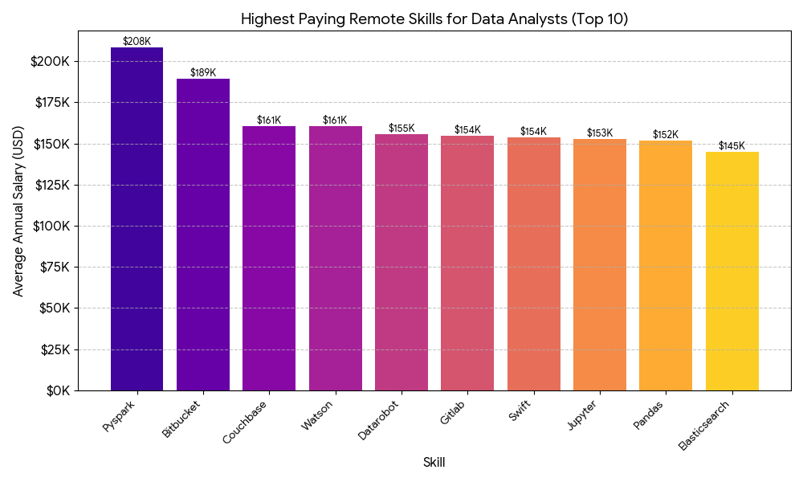

# Introduction
This project offers a focused, strategic analysis of the Data Analyst career path 📊. The research begins by pinpointing the **highest-paying remote roles** 💰 and the **specific skills needed** to attain them. It then broadens the scope to identify the **most in-demand skills** across the entire job market. 

The core of the analysis determines how different skills **impact average salary**, culminating in the identification of **Optimal Skills** (those offering both high demand and high pay) to guide professionals toward the most financially rewarding and secure career growth 🚀 in data analytics.

Want to check out the SQL queries? Kindly find them here [project_sql_folder](/project_sql)

# Background
This study leverages a 2023 financial year dataset of Data Analyst job postings—focusing specifically on those with specified salary information—to deconstruct the key factors influencing high-paying opportunities. The objective is to provide a strategic roadmap by systematically examining top salaries, identifying high-value skills, and ultimately isolating the most optimal skill investments that offer both market security (high demand) and significant financial returns (high average salaries). This approach ensures the findings are directly actionable for professionals aiming for career advancement in data analytics.

### The 5 Questions I wanted to answer through the sql queries are highlighted;
1. What are the top-paying data analyst jobs?
2. What are the skills required for these top_paying roles?
3. What are the most in-demand skills for data analyst?
4. What are the top skills based on salary?
5. What are the most **optimal** skills to learn (aka it is in high-demand and also has high-paying skill)?

# Tools I Used
To launch a deep dive into the analysis, a couple of tools were used to achieve these incredible outcome namely;

- **SQL**: This is the backbone of my analysis, allowing me to query the large dataset in the database to draw out inferences.
- **PostgreSQL**: The Database Management System (DBMS) was selected to house and handle the job posting dataset.
- **Visual Studio Code [VSCode]**: This was selected and used as the main DBMS to write SQL queries.
- **Git & GitHub**: This was selected and used as the version control system and also used to share my sql scripts and analysis, ensuring collaborations and project tracking

# The Analysis
Each lines of code is aimed at approaching the five different aspect of this analysis of the job market and below relates to how I solve them.

## 1. Top Paying Data Analyst Job
This identified the highest paying roles the same which I filtered by the average salary and locations, focussing on remote jobs. It highights the highest paying roles in the field.

```sql
SELECT
        job_id,
        job_title,
        job_title_short,
        job_schedule_type,
        Salary_year_avg,
        job_posted_date,
        name AS top_company_name
FROM
        job_postings_fact

-- To be able to include company name column of the top paying jobs 
-- (This is important because it's not on the main table)

LEFT JOIN company_dim ON job_postings_fact.company_id = company_dim.company_id
WHERE   
        job_title_short = 'Data Analyst' AND
        job_location = 'Anywhere' AND
        salary_year_avg IS NOT NULL
ORDER BY
        salary_year_avg DESC
LIMIT   10
```

- **💰 Extreme Salary Range and Outliers**: Top Data Analyst roles show extreme salaries: $\$184,000$ to an outlier peak of $\$650,000$ (Mantys). Excluding the anomaly, Meta at $\$336,500$ defines the high-tier compensation, highlighting vast market variance.
- 🏢 **Corporate Tiers and CompensationSalaries split into clear tiers**. Meta and AT&T lead the top band ($$200\text{K}$s+). A lower tier clusters between $\$184,000$ and $\$217,000$. This structure confirms that corporate brand and scale significantly influence compensation capacity.
- 📈 **Seniority vs. Specialization**: The most reliable high-pay driver is job seniority ("Director," "Principal"), averaging over $\$200,000$. However, the Mantys outlier shows that extreme specialization can achieve the absolute highest compensation, bypassing traditional title progression.



**Average Annual Salary by Company (Top Data Analyst Roles)**: The chart below visualizes the average annual salary offered by each company, sorted from highest to lowest.

**Figure: Average Annual Salary by Company (USD)**: The bar chart highlights the significant difference in compensation, with Mantys offering the highest average salary at $\$650\text{K}$, more than double the next highest average from Meta at $\$337\text{K}$.

## 2. Skills Required For Top Paying Roles
This identified the skills required for the top paying Jobs. This provides a detailed look at which high-paying  jobs demands certain
skills, helping job seekers understand which skills to develop that will align with top salaries.

```sql
WITH top_paying_jobs AS (
        SELECT
                job_id,
                job_title_short,
                salary_year_avg,
                name AS top_company_name
        FROM
                job_postings_fact

        LEFT JOIN company_dim ON job_postings_fact.company_id = company_dim.company_id
        WHERE   
                job_title_short = 'Data Analyst' AND
                job_location = 'Anywhere' AND
                salary_year_avg IS NOT NULL
        ORDER BY
                salary_year_avg DESC
        LIMIT   10
)

SELECT 
        top_paying_jobs.*,
        skills_dim.skills
FROM    
        top_paying_jobs
INNER JOIN
        skills_job_dim ON top_paying_jobs.job_id = skills_job_dim.job_id
INNER JOIN
        skills_dim ON skills_job_dim.skill_id = skills_dim.skill_id
ORDER BY
        salary_year_avg DESC
```
| Category                | Key Skills                    | Focus Level                                |
| ----------------------- | ----------------------------- | ------------------------------------------ |
| 🧮 **Core Analytics**   | SQL, Excel, R                 | 🟩🟩🟩🟩🟩🟩🟩🟩🟩🟩 **(Very High Focus)** |
| 💻 **Programming**      | Python                        | 🟩🟩🟩🟩🟩🟩🟩🟩🟩 **(High Focus)**        |
| 📊 **Visualization**    | Power BI, Tableau, PowerPoint | 🟨🟨🟨🟨🟨🟨🟨 **(Moderate–High Focus)**   |
| ☁️ **Cloud / Big Data** | Azure, Databricks, Snowflake  | 🟧🟧🟧🟧🟧 **(Emerging Focus)**            |

### SUMMARY INSIGHT

**SQL is foundational** — required by every top-paying role.
Python remains the second-most valuable technical skill.
Analysts who master visual storytelling (Power BI, Tableau) bridge the gap between data and decision.
Exposure to cloud ecosystems (Azure, Databricks, Snowflake) now differentiates top earners.

## 3. Skills Required For Top Paying Roles
This identified the the top 5 in-demand skills for data analyst with the highest demand in the job market,providing insight into the most valuable skills for job seekers.

```sql
SELECT
        skills,
        COUNT (skills_job_dim.job_id) AS skill_demand_count
FROM    job_postings_fact
INNER JOIN  skills_job_dim ON job_postings_fact.job_id = skills_job_dim.job_id
INNER JOIN  skills_dim ON skills_job_dim.skill_id = skills_dim.skill_id
WHERE
            job_title_short = 'Data Analyst' AND
            job_location = 'Anywhere'
GROUP BY
            skills
ORDER BY    skill_demand_count DESC
LIMIT 5
```

- 🔑 **Foundational Skill Dominance**:
SQL (7,291) is the most demanded skill, establishing it as the non-negotiable foundation for data handling. Excel (4,611) maintains a strong second place, confirming the persistent value of fundamental spreadsheet analysis. SQL's lead highlights its critical market importance.

- 💻 **Technical and Viz Integration**:
Python (4,330) is the third most demanded skill, reflecting increased technical requirements. Crucially, combined demand for visualization tools (Tableau and Power BI: 6,354) surpasses Python, showing that dashboard creation is nearly as vital as data retrieval and technical analysis.

- 🚀 **Strategic Skill Development**:
For a competitive edge, professionals need dual technical proficiency. While SQL is mandatory, developing Python for analysis and a visualization tool (Tableau/Power BI) is essential. The market demands end-to-end data pipeline capabilities.



***Demand Count for Top Data Analyst Skills***
The chart below visualizes the demand count for each skill, clearly showing SQL's dominance.

## 4. Skills Required For Top Paying Roles
This identified the the top skills based on salary lokking at the average salary associated with each skill for Data Analyst positions and also focusing on roles with specific salaries, regardless of job_location
This helped to reveals how different skills impact salary levels for Data Analysts and also help identify the most financially rewarding skills to acquire or improve.

```sql
SELECT
            skills,
            ROUND(AVG(salary_year_avg),0) AS average_salary
            
FROM
            job_postings_fact
INNER JOIN  skills_job_dim 
            ON job_postings_fact.job_id = skills_job_dim.job_id
INNER JOIN skills_dim ON skills_job_dim.skill_id = skills_dim.skill_id
WHERE
            job_title_short = 'Data Analyst'
            AND salary_year_avg IS NOT NULL
            AND job_work_from_home = TRUE
GROUP BY
            skills
ORDER BY
            average_salary DESC
LIMIT 5
```

💼✨ Top Paying Skills for Remote Data Analysts (2024)

| 💻 Skill                              | 💵 Avg. Salary |
| ------------------------------------- | -------------- |
| **PySpark**                           | $208K          |
| **Bitbucket**                         | $189K          |
| **Couchbase / Watson / DataRobot**    | $155–160K      |
| **GitLab / Swift / Jupyter / Pandas** | $150K+         |
| **Databricks / Kubernetes / Airflow** | $126–142K      |

### 💼✨ **Top Paying Skills for Remote Data Analysts (2024)

1. 1️⃣ **Data Engineering is the New Analytics**:
High-paying roles now demand tools like PySpark, Databricks, Airflow, and GCP — analysts 
who can build and automate data pipelines earn the most.

2. 2️⃣ **AI & Automation Lead the Pack**:
Skills such as Watson, DataRobot, and Scikit-learn show that the highest earners combine 
analytics with machine learning and automation.

3. 3️⃣ **The Hybrid Analyst Emerges**
Today’s top analysts master Python, GitLab, and Cloud tools, blending coding, visualization, 
and data strategy — becoming Data Engineer + Analyst hybrids.



### Highest Paying Remote Skills for Data Analysts (Top 10)
The chart below visualizes the average annual salary associated with the top 10 highest-paying skills for remote Data Analysts.

## 5. Skills Required For Top Paying Roles
This identified the the the most optimal skills to learn (aka it is high-demand and a high-paying skill) while concentrating on remote positions with specified salaries
- Target skills that offer job seciruty (high-demand)
- And with Fiancial benefits (high avg salaries) offering startegic insights for career development in data Analytics.

```sql
SELECT
        skills_dim.skill_id,
        skills_dim.skills,
        COUNT(skills_job_dim.job_id) AS skill_demand_count,
        ROUND(AVG(job_postings_fact.salary_year_avg),0) AS avg_salary
FROM    job_postings_fact
INNER JOIN
        skills_job_dim ON
        job_postings_fact.job_id = skills_job_dim.job_id
INNER JOIN
        skills_dim ON
        skills_job_dim.skill_id = skills_dim.skill_id
WHERE
        job_title_short = 'Data Analyst'
        AND salary_year_avg IS NOT NULL
        AND job_work_from_home = TRUE
GROUP BY
        skills_dim.skill_id, skills_dim.skills
HAVING
        COUNT (skills_job_dim.job_id)>10
ORDER BY
        avg_salary DESC
LIMIT 25
```

### SUMMARY OF INSIGHTS FROM THE MOST OPTIMAL SKILL FOR DATA ANALYST ROLES BASED ON AVERAGE SALARY OF THE TOP-PAYING SKILL AND TOP DEMANDED SKILL

1. SQL, Excel, and Python are the top 3 most in-demand skills for Data Analysts, 
   showing the strongest presence in job postings.

2. Python, R, and Tableau lead in terms of higher average salaries, with 
   Python reaching over $101K on average.

3. Emerging tech skills like Snowflake, Azure, and Go offer premium pay 
   ($110K–$115K) despite lower demand, highlighting niche expertise value.

| Skill           | Demand 📊                                          | Avg Salary 💰 | Salary Level |
| :-------------- | :------------------------------------------------- | :------------ | :----------- |
| **SQL**         | ██████████████████████████████████████████████ 398 | **$97K**      | 🟩 High      |
| **Excel**       | ███████████████████████████████ 256                | **$87K**      | 🟨 Mid       |
| **Python**      | ██████████████████████████ 236                     | **$101K**     | 🟩 High      |
| **Tableau**     | ████████████████████████ 230                       | **$99K**      | 🟩 High      |
| **R**           | ████████████████ 148                               | **$100K**     | 🟩 High      |
| **Power BI**    | ███████████ 110                                    | **$97K**      | 🟩 High      |
| **SAS**         | ████████ 63                                        | **$99K**      | 🟩 High      |
| **Looker**      | ████ 49                                            | **$104K**     | 🟩💎 Premium |
| **Snowflake**   | ███ 37                                             | **$113K**     | 🟦 Elite     |
| **Go (Golang)** | ███ 27                                             | **$115K**     | 🟦 Elite     |
| **Hadoop**      | ██▌ 22                                             | **$113K**     | 🟦 Elite     |
| **Confluence**  | █▌ 11                                              | **$114K**     | 🟦 Elite     |


# What I Learned
🧠 What I Learned From This AnalysisThe primary takeaway from analyzing the Data Analyst market is the strategic tension between seniority and specialization. While securing a senior title (like Principal or Director) reliably guarantees a high salary floor (often exceeding $\$220,000$), the absolute highest compensation is reserved for extreme specialization—particularly in Big Data and MLOps tools like PySpark ($\$208\text{K}$) and Bitbucket. This shows that the market places its biggest premium on skills that move analysis into production at scale.

# Conclusions
The Data Analyst job market is highly polarized by compensation, with high-tier salaries ($\$150\text{K}+$) being driven by both corporate scale and technical depth. To maximize earning potential, professionals must ensure mastery of foundational skills (SQL) while strategically acquiring dual technical proficiency in advanced production-ready skills. Focusing on MLOps, DevOps, and Big Data concepts offers the clearest path to achieving the highest remote salaries, establishing a competitive edge well beyond basic data retrieval and visualization.

# Closing Thoughts
This project enhanced my SQL skills and provided valuable insights into the data Analyst job narket. it also highlight that the path to top-tier Data Analyst compensation requires a shift from pure reporting to strategic specialization. Success hinges on mastering the non-negotiable foundations (like SQL) while aggressively acquiring skills that push data analysis into production and scale, such as PySpark and MLOps/DevOps concepts, to command the highest salaries in the remote market.